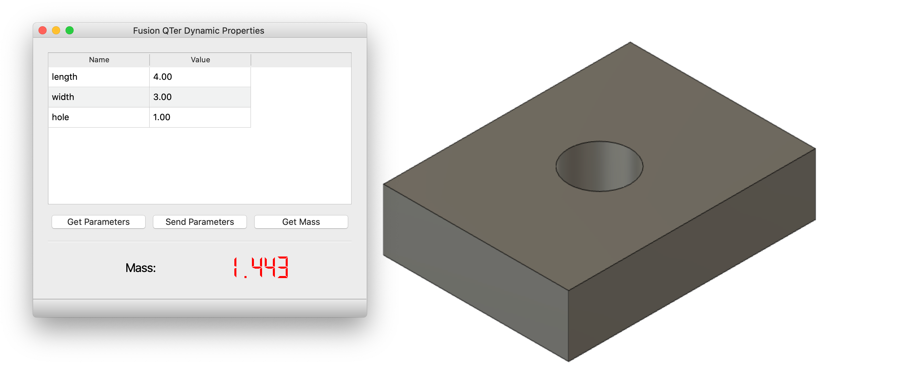
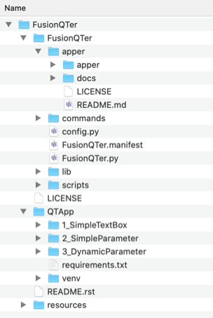

FusionQTer
==========
Demo app showing communication between a standalone QT Application and a Fusion 360 Add-in.

.. image:: resources/FusionQTer_main.png

Overview
--------
This repo contains essentially two independent sets of applications.

**/QTApp**

This is a collection of "standalone" python apps that uses PySide6 (QT) to create a simple GUI.

They will communicate to your Fusion360 Addin over a local socket connection.

**/FusionQTer**

This is a Fusion 360 add-in that will communicate to the standalone application.

By sending a receiving messages over a local socket connection you can react to commands executed in a
separate application and send data responses back.

Installation
------------
To run this example you need to make sure that the Fusion 360 addin
and the standalone application have all of their requirements and are properly configured

**IMPORTANT**
Before proceeding make sure you have installed and properly configured:

 - `Python Interpreter <#python-interpreter>`_
 - `GIT <#git>`_

Step 1: Clone this repo
^^^^^^^^^^^^^^^^^^^^^^^
Navigate to your desired location in a terminal, clone the repo and update the apper sub-module:

*Optionally you can clone this into the `Fusion 360 add-ins directory <#fusion-360-addins-directory>`_,
but that is not necessary*

Once you have navigated to the desired location clone the repo:

.. code-block:: bash

    git clone https://github.com/tapnair/FusionQTer.git

Step 2: Setup Standalone QT App Environment
^^^^^^^^^^^^^^^^^^^^^^^^^^^^^^^^^^^^^^^^^^^
You SHOULD create a virtual environment in the QTApp Directory to run the standalone app.

Execute the following commands in the root directory of this repo:

.. code-block:: bash

    cd QTApp
    python3 -m venv venv/
    source venv/bin/activate
    pip3 install -r requirements.txt

Step 3: Setup Fusion 360 Add-in
^^^^^^^^^^^^^^^^^^^^^^^^^^^^^^^
Navigate to the repo root directory in a terminal and update the apper sub-module:

.. code-block:: bash

    cd FusionQTer
    cd FusionQTer
    cd apper
    git submodule init
    git submodule update

The ``apper`` directory inside of the ``FusionQTer`` directory should now be fully populated.

If this is not the case or you are having significant difficulty cloning the repo with git or
syncing the sub-module directly through git, which is sometimes common,
you can download this repo manually and download the apper source files directly from
`the apper repo <https://github.com/tapnair/apper>`_.

Step 4: Verify Dependencies
^^^^^^^^^^^^^^^^^^^^^^^^^^^
It is **VERY IMPORTANT** that you get the naming correct.

For example manually downloaded github repos typically append the ``-master`` suffix to the zip file.

Ultimately you should have a directory structure that looks like this:

Step 5: Launch the add-in in Fusion 360
^^^^^^^^^^^^^^^^^^^^^^^^^^^^^^^^^^^^^^^
You need to actually register the add-in location in Fusion 360:

.. image:: resources/addin_dialog.png

1. In Fusion 360 launch the **Scripts and Add-ins** command and select the add-ins tab
2. Press the green plus sign
3. Navigate to the *FusionQTer/FusionQTer* sub-directory
4. Click **Open** to add this as a recognized add-in within Fusion 360
5. Now select **FusionQTer** in the add-ins list and click: **Run**

Usage
-----
**Note: It is important to do it in this order!**

The QT App needs to start first.  It is setting up a Listener client and waiting for a connection
before displaying the UI.

If you are doing testing and need to restart the standalone QT App
you will also need to reset the connection from Fusion 360
there is a command to do that from the QTer toolbar.

Step 1
^^^^^^
Run one of the ``main.py`` files from one of the QTApp sample directories in the virtual environment.

*See above for how to create the virtual environment.*

Assuming you are in a terminal in the ``QTApp/1_SimpleTextBox`` Directory:

.. code-block:: bash

    python3 ./main.py

You can also use your IDE (VS Code, PyCharm, etc.) to create a run configuration for this.

Step 2
^^^^^^
Start the addin from within Fusion 360 (if it is not already started).

If you close the QT APP or make changes and restart it you need to restart
the connection thread in Fusion 360.

You should see a command that will do this from the Fusion 360 GUI.

Requirements
------------
The following libraries and their subsequent dependencies are used for the **QTApp**

 - PySide6

License
-------
Samples are licensed under the terms of the `MIT License <http://opensource.org/licenses/MIT>`_.
Please see the [LICENSE](LICENSE) file for full details.

Authors
-------
`FusionQTer` was written by `Patrick Rainsberry <patrick.rainsberry@autodesk.com>`_.

Additional Notes
----------------
A few miscellaneous notes on usage and setup

Fusion 360 Addins Directory
^^^^^^^^^^^^^^^^^^^^^^^^^^^^
Here are the typical locations of the standard Fusion 360 add-ins directory:

**Mac:**

*/Users/**USERNAME**/Library/Application Support/Autodesk/Autodesk Fusion 360/API/AddIns/*

.. code-block:: bash

    cd ~/Library/Application\ Support/Autodesk/Autodesk\ Fusion\ 360/API/AddIns

**Windows:**

*C:\Users\**USERNAME**\AppData\Autodesk\Autodesk Fusion 360\API\AddIns*

.. code-block:: bash

    cd %AppData%\Autodesk\Autodesk Fusion 360\API\AddIns

Python Interpreter
^^^^^^^^^^^^^^^^^^
Install Python for your operating system. Fusion 360 uses Python 3.7 so it is recommended to install this version locally as it will simplify setting up your development environment in general.

Consult the official `Python documentation <https://docs.python.org/3/using/index.html>`_ for details.

You can install the Python binaries from `python.org <https://www.python.org/downloads/mac-osx/>`_.

GIT
^^^
Git is a free and open source distributed version control system designed to handle everything from small to very
large projects with speed and efficiency.

You will need to have git installed to properly setup your local environment.
It is recommended to just `install github desktop <https://desktop.github.com/>`_
if you do not already have git installed locally.

Alternatively you can review other
`installation options <https://git-scm.com/book/en/v2/Getting-Started-Installing-Git>`_.

Adjust Your path
^^^^^^^^^^^^^^^^
Ensure that your ``bin`` folder is on your path for your platform.
Typically ``~/.local/`` for UNIX and macOS, or ``%APPDATA%\Python`` on Windows.
(See the Python documentation for `site.USER_BASE <https://docs.python.org/3/library/site.html#site.USER_BASE>`_
for full details.)

**MacOS**

For bash shells, add the following to your ``.bash_profile`` (adjust for other shells):

Add ``~/.local/`` to ``PATH`` with the following shell command:

.. code-block:: bash

    export PATH=$HOME/.local/bin:$PATH

Remember to load changes with ``source ~/.bash_profile`` or open a new shell session.

**Windows**

Ensure the directory where cookiecutter will be installed is in your environment's ``Path``
in order to make it possible to invoke it from a command prompt.
To do so, search for "Environment Variables" on your computer
(on Windows 10, it is under``System Properties`` --> ``Advanced``) and add that directory to the ``Path``
environment variable, using the GUI to edit path segments.

Example segments should look like ``%APPDATA%\Python\Python3x\Scripts``,
where you have your version of Python instead of ``Python3x``.

You may need to restart your command prompt session to load the environment variables.

Setting up Python on Windows can be ridiculously frustrating for some reason.  There are many other ways to do it.
There are a number of resources online to help, such as
`Configuring Python (on Windows) <https://docs.python.org/3/using/windows.html#configuring-python>`_
but I encourage you  to look further if you are still having trouble.

