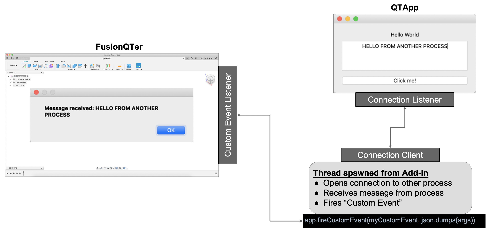
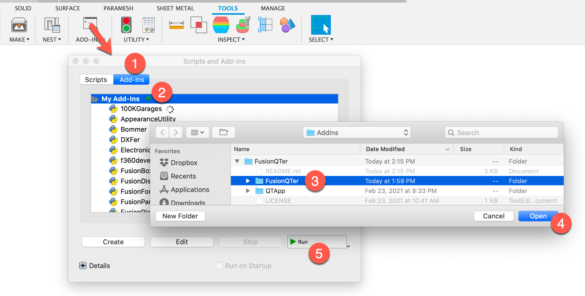

FusionQTer
==========
Demo app showing communication between a standalone QT Application and a Fusion 360 Add-in.

Installation
------------
To run this example you need to make sure that the Fusion 360 addin
and the standalone application have all of their requirements:

Step 1: Clone this repo
^^^^^^^^^^^^^^^^^^^^^^^
Navigate to your desired location in a terminal, clone the repo and update the apper sub-module:

*Optionally you can clone this into the Fusion 360 add-ins directory, but that is not necessary*

.. code-block:: bash

    % cd /Users/MY_USER_NAME/Library/Application\ Support/Autodesk/Autodesk\ Fusion\ 360/API/AddIns
    % git clone https://github.com/tapnair/FusionQTer.git
    % git submodule update --remote

Step 2: Create a virtual environment
^^^^^^^^^^^^^^^^^^^^^^^^^^^^^^^^^^^^
You need to create a virtual environment in the QTApp Directory to run the standalone app.

Execute the following commands in the root directory of this repo:

.. code-block:: bash

    % cd QTApp
    % python3 -m venv venv/
    % pip3 install -r requirements.txt
    % source venv/bin/activate

Step 3: Launch the add-in in Fusion 360
^^^^^^^^^^^^^^^^^^^^^^^^^^^^^^^^^^^^^^^
You need to actually register the add-in location in Fusion 360:

1. In Fusion 360 launch the **Scripts and Add-ins** command and select the add-ins tab
2. Press the green plus sign
3. Navigate to the *FusionQTer/FusionQTer* sub-directory
4. Click **Open** to add this as a recognized add-in within Fusion 360
5. Now select **FusionQTer** in the add-ins list and click: **Run**

Overview
--------
This repo contains essentially two independent applications.

**/QTApp**

This is a "standalone" python app that uses PySide (QT) to create a simple GUI.

**/FusionQTer**

This is actually the directory of the Fusion 360 add-in

Usage
-----
**Note: It is important to do it in this order!**
Step 1
^^^^^^
Run the python file ``QTApp/main.py`` in a virtual environment.

*See above for how to create the virtual environment.*

Assuming you are in a terminal in the ``QTApp`` Directory:

.. code-block:: bash

    % python3 ./main.py

You can also use your IDE (VS Code, PyCharm, etc.) to create a run configuration for this.

Step 2
^^^^^^
Start the addin from within Fusion 360.

If you close the QT APP or make changes and restart it you need to restart
the connection thread in Fusion 360.
You should see a command that will do this from the Fusion 360 GUI.

Requirements
------------
The following libraries and their subsequent dependencies are used for the **QTApp**

 - PySide6

 - shiboken6

License
-------

Samples are licensed under the terms of the [MIT License](http://opensource.org/licenses/MIT). Please see the [LICENSE](LICENSE) file for full details.

Authors
-------

`FusionQTer` was written by `Patrick Rainsberry <patrick.rainsberry@autodesk.com>`_.
